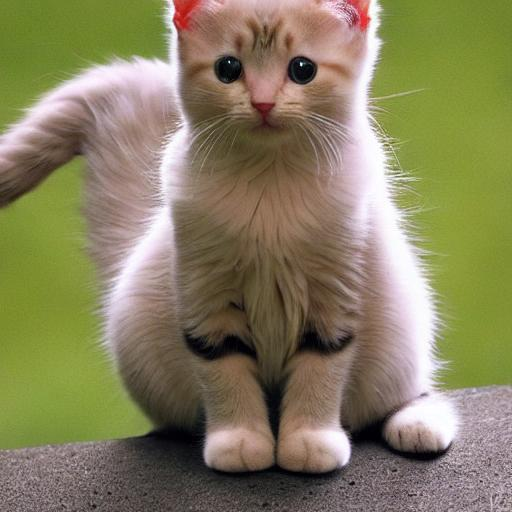
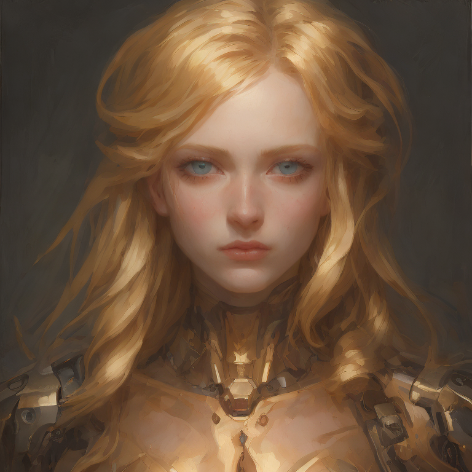
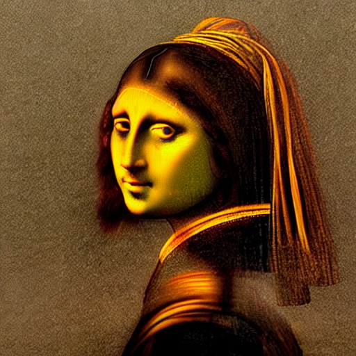
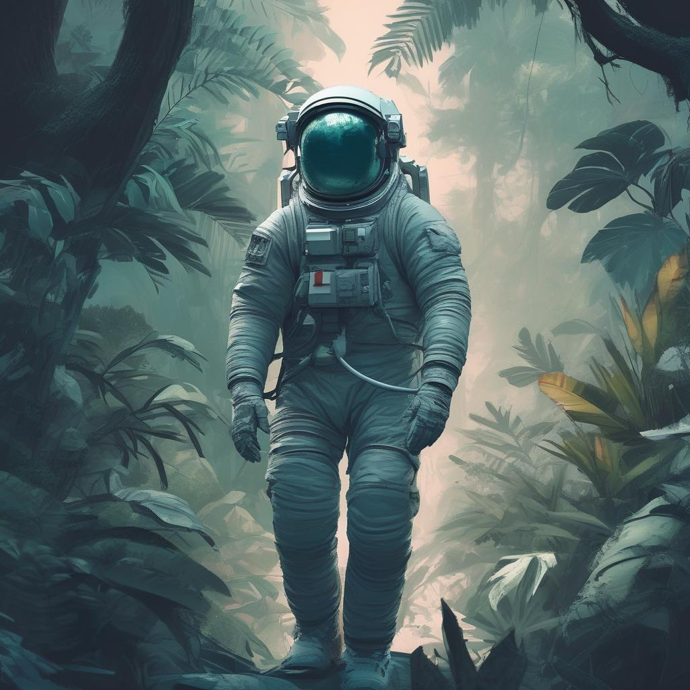
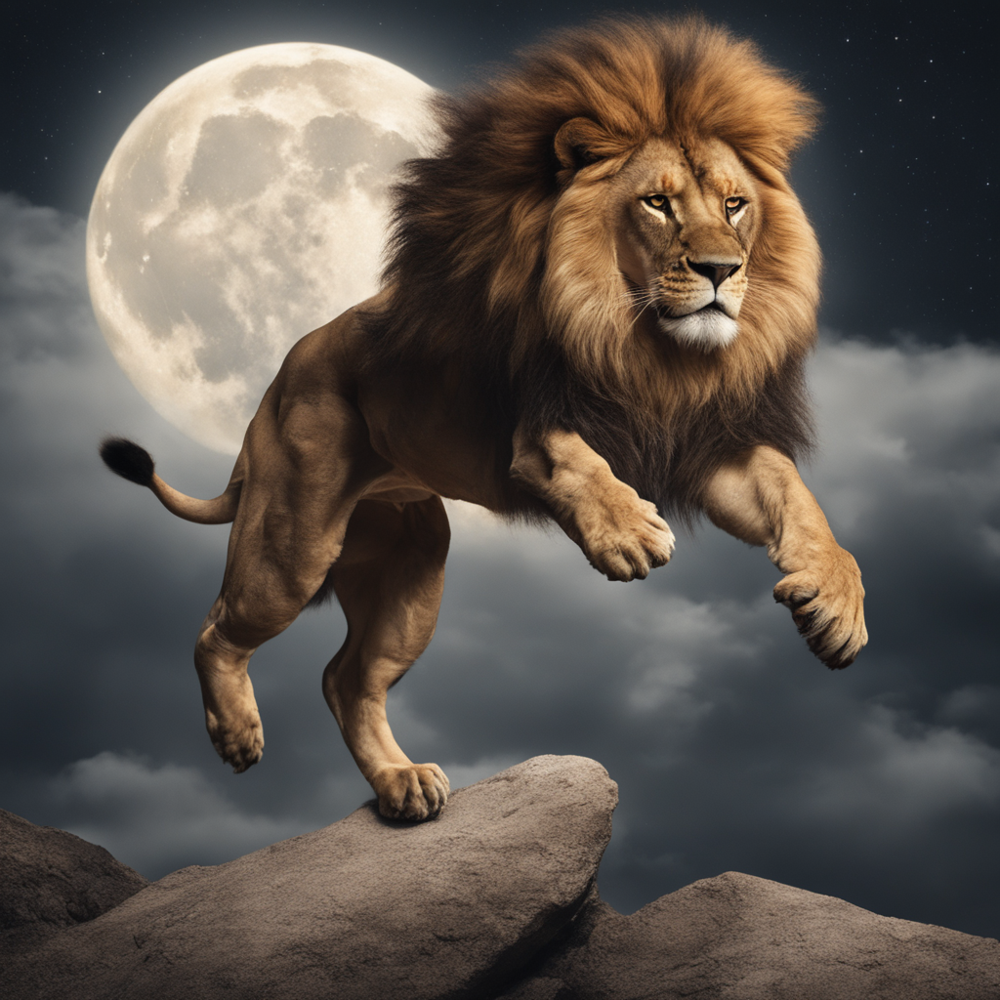
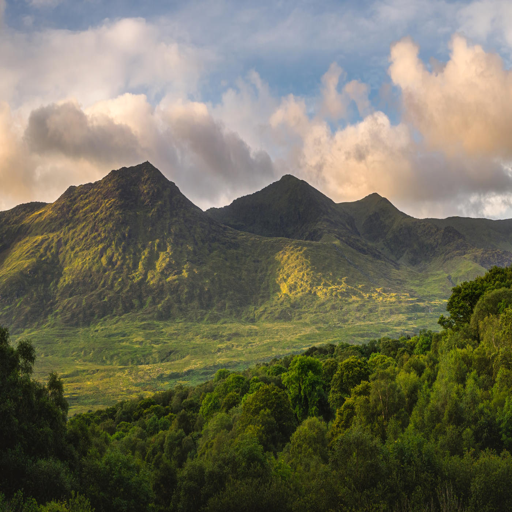
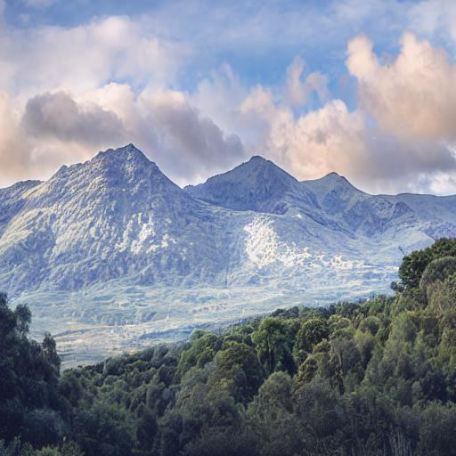
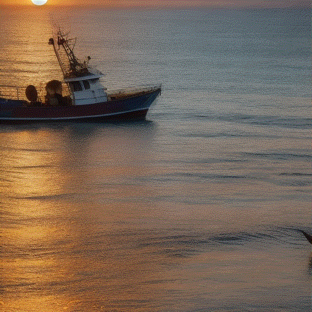

# JDiffusion

## Introduction

JDiffusion is a diffusion model library for generating images or videos based on [Jittor](https://github.com/Jittor/jittor), [Jtorch](https://github.com/JITTorch/jtorch), [diffusers](https://github.com/huggingface/diffusers).

## Installation
### 0. Clone JDiffusion & Prepare Env
```bash
git clone https://github.com/JittorRepos/JDiffusion.git
#We recommend using conda to configure the Python environment.
conda create -n jdiffusion python=3.9
conda activate jdiffusion
```
### 1. Install Requirements

Our code is based on JTorch, a high-performance dynamically compiled deep learning framework fully compatible with the PyTorch interface, please install our version of library.

```bash
pip install git+https://github.com/JittorRepos/jittor
pip install git+https://github.com/JittorRepos/jtorch
pip install git+https://github.com/JittorRepos/diffusers_jittor
pip install git+https://github.com/JittorRepos/transformers_jittor
```
or just
```bash
pip install -r requirement.txt
```
### 2. Install JDiffusion
```bash
cd JDiffusion
pip install -e .
```
We also provide a [docker image](https://cg.cs.tsinghua.edu.cn/jittor/assets/docker/jdiffusion.tar) (md5:62c305028dae6e62d3dff885d5bc9294) about our environment.

### 3.Optional Requirements
 If you encounter `No module named 'cupy'`:
```bash
# Install CuPy from source
pip install cupy
# Install CuPy for cuda11.2 (Recommended, change cuda version you use)
pip install cupy-cuda112
```

## Usage

Use just like diffusers, our scripts are in `./examples/test_*.py`, you can try on it.

Some example outputs on these scripts are in `./examples/output`.

### Stable Diffusion

`"a photo of a cat"`



### Latent Consistency Model(LCM)

`"Self-portrait oil painting, a beautiful cyborg with golden hair, 8k"`



### Control-Net

`input image` :


`"the mona lisa"`



### SDXL

- text to image

    `"Astronaut in a jungle, cold color palette, muted colors, detailed, 8k"`

    

- refiner

    `"A majestic lion jumping from a big stone at night"`

    

### Instruct-Pix2Pix

`input image` :



`"make the mountains snowy"`:




### AnimateDiff

```
"masterpiece, bestquality, highlydetailed, ultradetailed, sunset, moon on the sky"
"orange sky, warm lighting, fishing boats, ocean waves seagulls, "
"rippling water, wharf, silhouette, serene atmosphere, dusk, evening glow, "
"golden hour, coastal landscape, seaside scenery"
```




## Level of Support
We now support inference.

Some acceleration tools and memory-saving tools are currently unavailable, like `offload, vae_slicing, accelerators`..., but you can use jittor's shared memory system.

We welcome more individuals to contribute additional code and models to this repository, in support of the [Jittor](https://github.com/Jittor/jittor) community.

