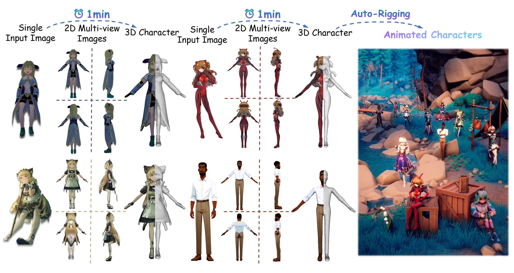

# CharacterGen

This is the jittor official codebase of SIGGRAPH'24 (TOG) [CharacterGen](https://charactergen.github.io/) for 2D Stage.



## Usage

You can first install requirements of python3.10.

```bash
pip install -r requirements.txt
```

Secondly, you should uninstall `torch` and then install the [requirements of JDiffusion](../../README.md).

Next, you can run the `webui.py` to run the web server to get the results of input image.

```bash
python webui.py
```